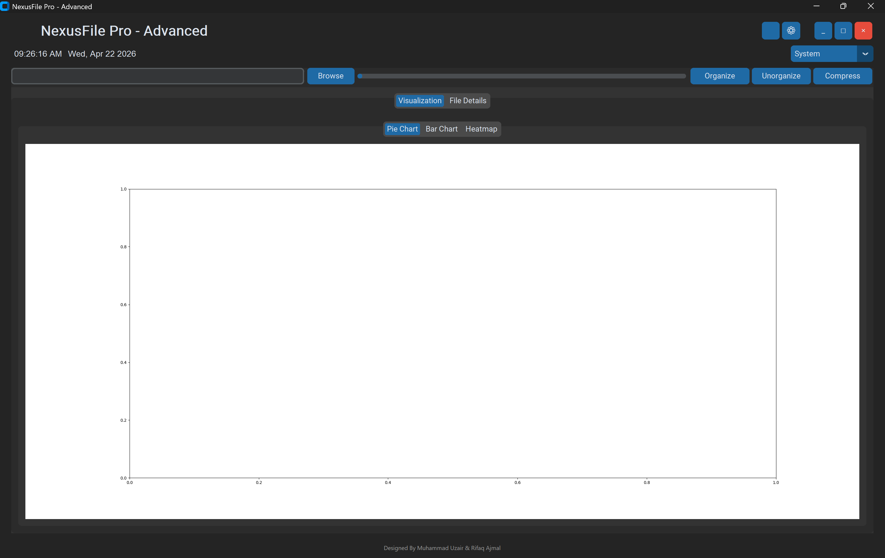
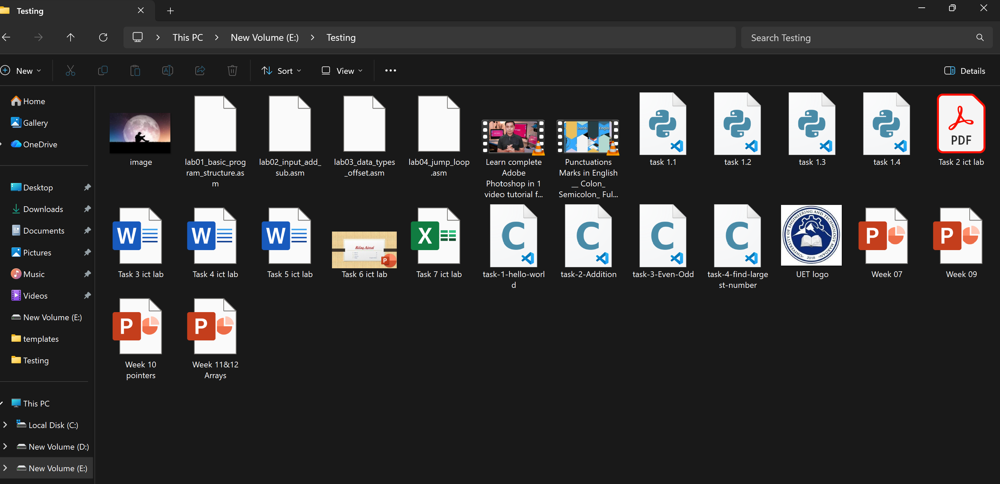
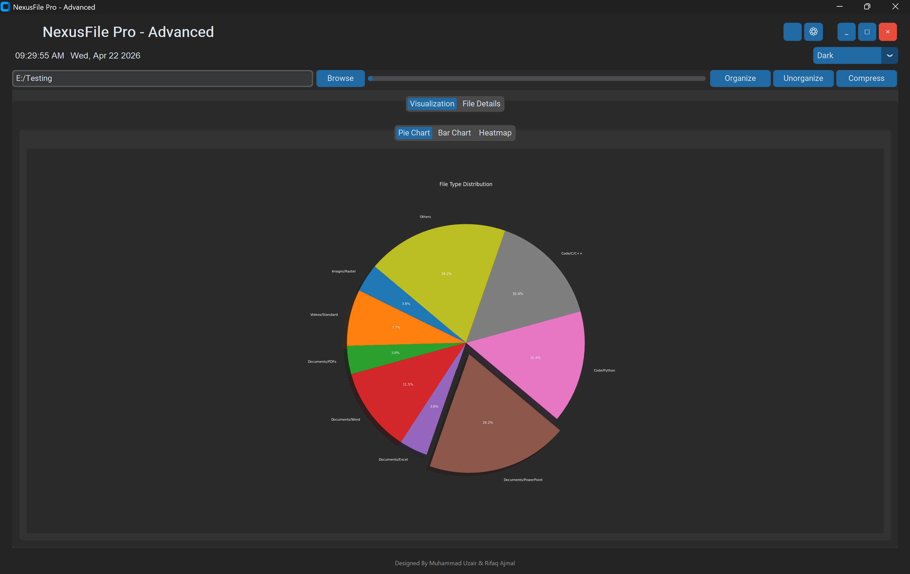
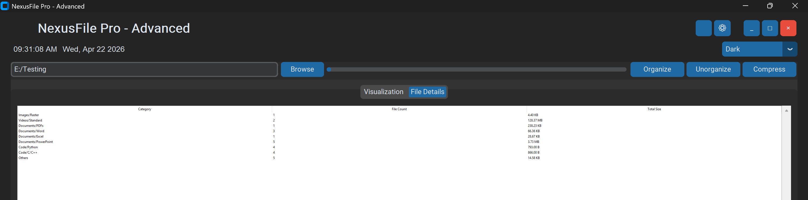
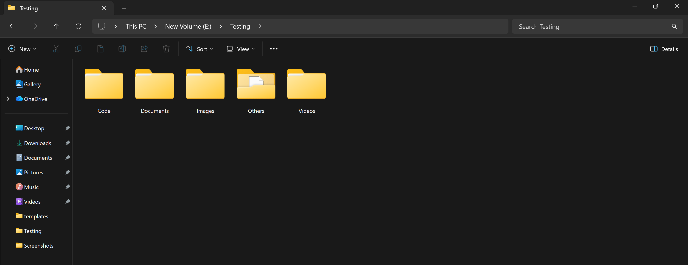

# Nexus File Organizer


Nexus File Organizer is a desktop application developed in **Python** that automatically organizes files inside a selected folder and provides visual insights about the folder contents.

The application allows users to select a folder and automatically categorize files into separate folders such as **documents, images, videos, and other file types**, making file management cleaner and more efficient.

In addition to file organization, the application also provides **visual analytics** of folder data using graphs.

---

## Features

- Automatically organize files by **file type**
- Organize files **alphabetically**
- Organize files by **date**
- Organize files by **file size**
- Automatic folder creation for different file categories
- View folder insights using **Pie Chart, Bar Chart, and Heat Graph**
- Display **folder details and total file count**
- **Dark Mode, Light Mode, and System Theme** support
- Option to **unorganize files**
- Ability to **compress folders into ZIP files**
- Simple and user-friendly **Graphical User Interface (GUI)**

---

## Technologies Used

- Python
- CustomTkinter
- Pandas
- Matplotlib
- Pillow (PIL)

---

## Installation

### 1 Clone the repository

```bash
git clone https://github.com/yourusername/Nexus-File-Organizer.git
```

### 2 Navigate to the project folder

```bash
cd Nexus-File-Organizer
```

### 3 Install required libraries

```bash
pip install pandas matplotlib pillow customtkinter
```

### 4 Run the application

```bash
python NexusFile_Pro.py
```

---

## Project Structure

```
Nexus-File-Organizer
│
├── NexusFile_Pro.py
├── NexusFile_Pro.spec
├── assets
│   ├── 1.Interface.png
│   ├── 2.testing_folder.png
│   ├── 3.Pie_Chart.png
│   ├── 4.Folder_detail.png
│   └── 5.After_organizing.png
│
└── README.md
```

---

## Application Preview

### Interface


### Testing Folder


### Pie Chart


### Folder Details


### After Organizing Files


---

## Authors

**Rifaq Ajmal**  
**Muhammad Uzair**

BS Computer Science – Semester Project
